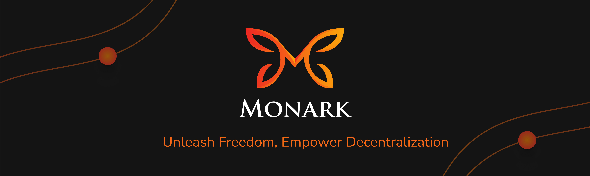

# 🦋 Monark.io



Welcome to the Monark website — our home on the web and a gateway for students, builders, and curious minds exploring Web3.

Built with [Next.js](https://nextjs.org), styled with [Tailwind](https://tailwindcss.com/), and deployed on [Vercel](https://vercel.com). Fast, modern, and human-first — just how we like it.

---

## 🚀 Quick Start

```bash
git clone git@github.com:monark-community/website.git
npm i
npm run dev
# or yarn dev / pnpm dev / bun dev
```

Open [http://localhost:3000](http://localhost:3000) to view the site. 
Edit `app/page.tsx` to start building.

---

## 🛠 Stack

- **Framework**: Next.js (App Router)
- **Styling**: Tailwind CSS
- **Hosting**: Vercel

Built to be clean, fast, and scalable.

---

## 🧠 Learn More

- [Next.js Docs](https://nextjs.org/docs)
- [Next.js Interactive Tutorial](https://nextjs.org/learn)

Got feedback or want to help? Jump in.

---

Made with curiosity by the Monark team.  
🌐 [monark.io](https://monark.io)